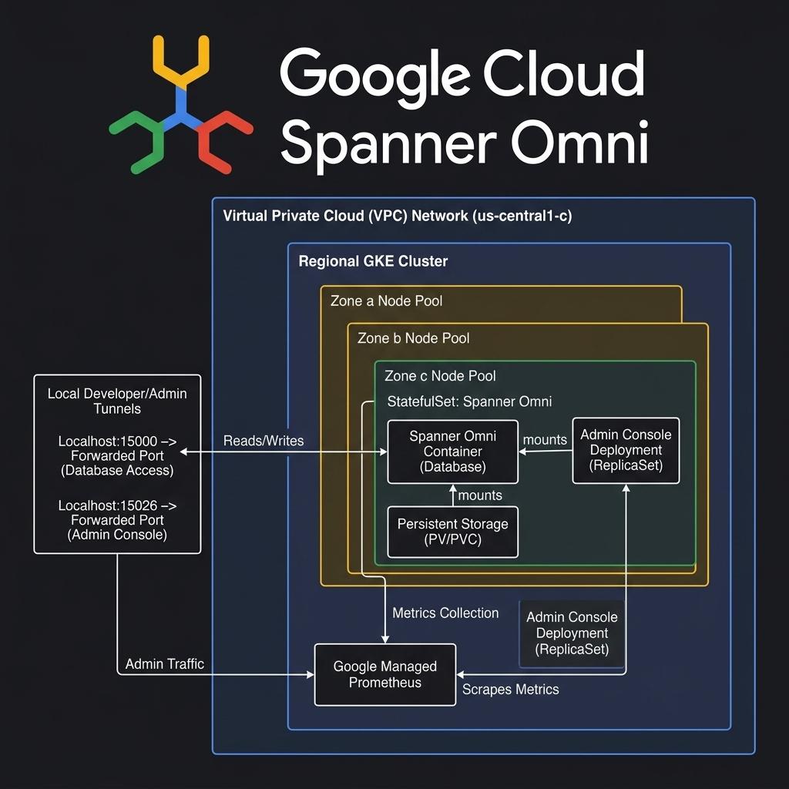
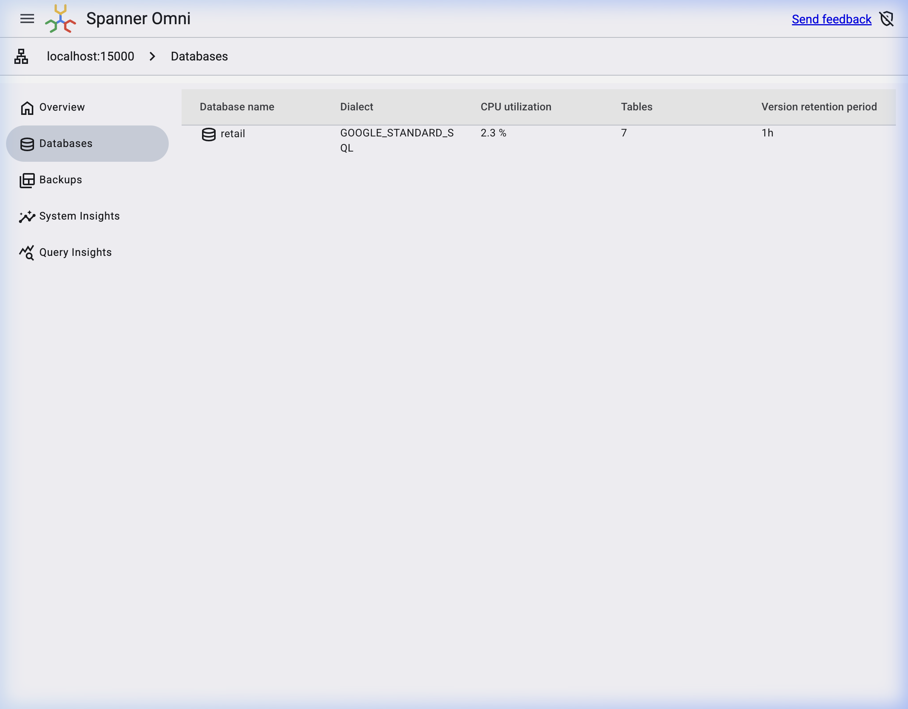
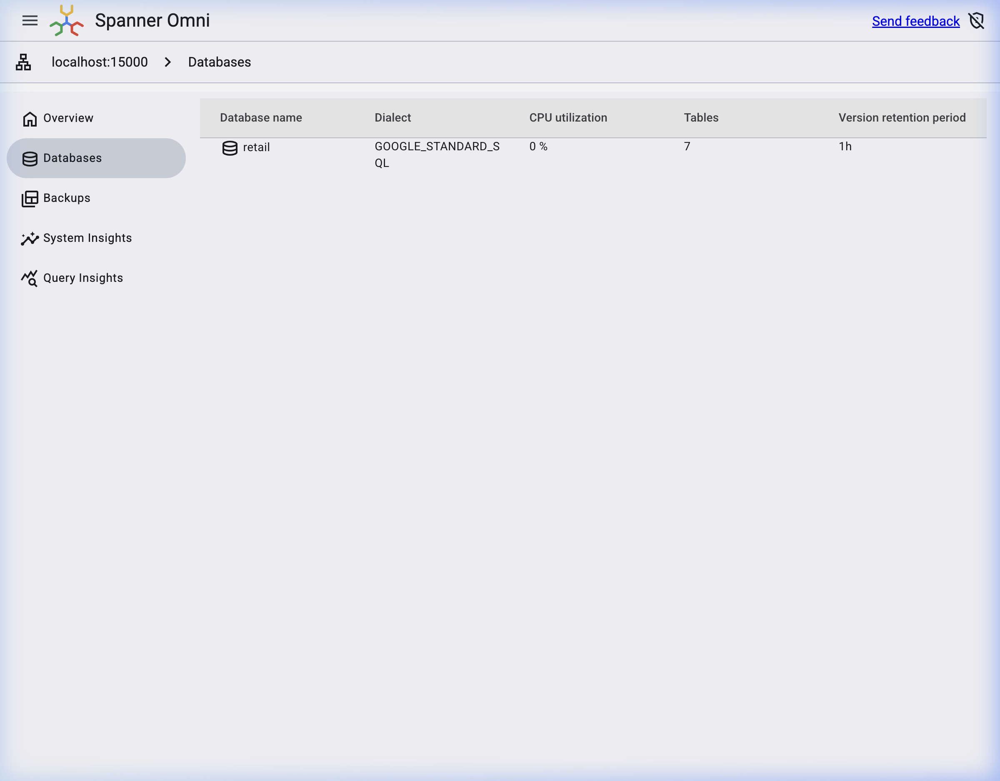
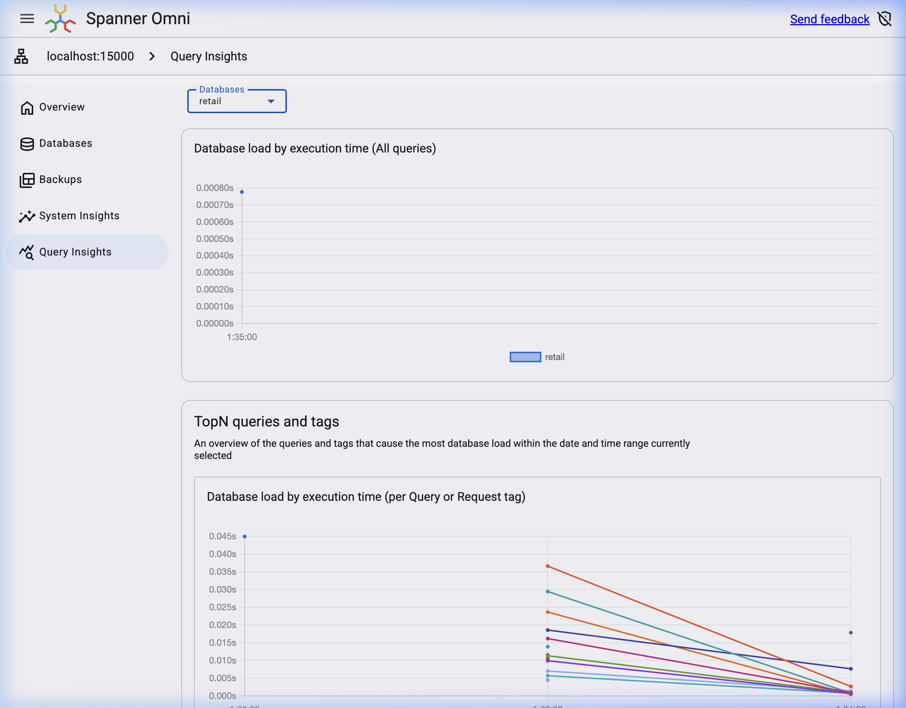

<p align="center">
  
</p>

# Google Cloud Spanner Omni on GKE Demo

[](https://io.google/2026/)
[](https://io.google/2026/)
[](https://github.com/sanketbisne)

This repository contains the complete, production-quality automated deployment configuration to run **Google Cloud Spanner Omni** on a Google Kubernetes Engine (GKE) cluster.

This demo was designed and presented at **Google I/O Connect India 2026, Bengaluru** by **Sanket Bisne** to showcase running Google's flagship relational database engine on self-managed Kubernetes infrastructure.

---

## 📐 Architecture Diagram

Below is the deployment topology for Spanner Omni on GKE:



---

## 📂 Project Structure

```
spanner-omni-demo/
│
├── README.md                      # Main deployment & walkthrough guide
├── architecture.png               # High-resolution architectural diagram
│
├── docs/
│     ├── setup.md                 # Deep-dive setup guide
│     ├── troubleshooting.md       # Debugging, logs, and common pitfalls
│     ├── demo-script.md           # Presentation script & live speaker notes
│     └── images/                  # Screenshots and verification media
│           ├── spanner_logo.png                  # Official Spanner product logo
│           ├── spanner_databases_loaded.png      # Retail database schema tables
│           ├── spanner_databases_view.png        # Spanner Omni console database list
│           └── spanner_query_insights_retail.png # Query insights dashboard
│
├── terraform/
│     ├── main.tf                  # Infrastructure (APIs, VPC, Subnets, GKE)
│     ├── variables.tf             # Terraform input configurations
│     └── outputs.tf               # Outputs (kubeconfig connect commands)
│
├── scripts/
│     ├── 01-prerequisites.sh      # Validates environment and CLI tools
│     ├── 02-create-project.sh     # Selects/creates GCP project and checks billing
│     ├── 03-enable-apis.sh        # Enables GKE, compute, and registry APIs
│     ├── 04-create-gke.sh         # Provisions GKE cluster via gcloud or Terraform
│     ├── 05-install-tools.sh      # Downloads local Spanner CLI binary
│     ├── 06-install-spanner-omni.sh # Deploys Spanner Omni Helm chart & monitoring
│     ├── 07-port-forward.sh       # Forwards database (15000) & Console (15026) ports
│     ├── 08-create-sample-db.sh   # Creates and seeds Retail database in container
│     ├── 09-run-demo.sh           # Runs basic and analytical SQL queries
│     └── cleanup.sh               # Tears down GKE cluster and local temp folders
│
├── sql/
│     ├── queries.sql              # Basic database exploration queries
│     └── analytics.sql            # Revenue & analytics aggregation queries
│
└── manifests/
      ├── spanner-values.yaml      # Spanner Omni Helm configuration values
      ├── prometheus-operator.yaml # ServiceMonitor/GMP scraping manifests
      └── grafana-dashboard.json   # Spanner Omni system metrics dashboard
```

---

## 🛠️ Prerequisites

Before running the deployment scripts, make sure your local environment has the following tools installed and running:

*   **gcloud CLI** (authenticated: `gcloud auth login`)
*   **kubectl**
*   **Helm** (v3+)
*   **jq** and **yq**
*   **Docker Desktop** (optional, for local container checks)
*   **Terraform** (optional, for declarative cluster provisioning)

---

## 🚀 Installation & Deployment Walkthrough

To run the entire demo, execute the scripts in numerical order:

### 1. Check Prerequisites
Verify that all CLI utilities are installed and that you have an active gcloud session.
```bash
./scripts/01-prerequisites.sh
```

### 2. Configure Google Cloud Project
Specify your target Project ID (and billing account if creating a new project) and bind the session.
```bash
export GCP_PROJECT_ID="your-project-id"
export GCP_BILLING_ACCOUNT_ID="012345-6789AB-CDEF01" # Optional

./scripts/02-create-project.sh
```

### 3. Enable Required APIs
Enable services including GKE (`container.googleapis.com`), Compute Engine, and Artifact Registry.
```bash
./scripts/03-enable-apis.sh
```

### 4. Create GKE Cluster
Deploy a regional GKE Standard cluster with autoscaling `e2-standard-4` nodes.
```bash
# To deploy using gcloud CLI:
./scripts/04-create-gke.sh

# Or to deploy using Terraform:
export USE_TERRAFORM="true"
./scripts/04-create-gke.sh
```

### 5. Download Spanner CLI
Downloads the official Spanner Omni CLI tool locally (under `./bin/spanner`).
```bash
./scripts/05-install-tools.sh
```

---

## ☸️ Helm Chart Configuration & Deployment

Spanner Omni is packaged and installed using an official Helm chart. The deployment utilizes custom resource profiles designed to fit GKE node constraints.

### 1. Helm Configuration (`manifests/spanner-values.yaml`)
Due to GKE Standard node allocations, resource constraints are set to `cpu: 2` and `memory: 8Gi` to prevent database engine memory starvation and gRPC timeouts while leaving headroom for Kubernetes system daemons:
```yaml
global:
  platform: gke
  insecureMode: true

deployment:
  singleServer: true

# Spanner container memory/CPU footprint
resources:
  cpu: 2
  memory: 8Gi

storage:
  data:
    size: "20Gi"
  logs:
    size: "5Gi"

# Deploying fresh without upgrading active schema
skipPrepareUpgrade: true

dataStorageClass: "premium-rwo"
logsStorageClass: "premium-rwo"

console:
  enabled: true
  service:
    type: ClusterIP
    port: 15026

service:
  type: ClusterIP
  port: 15000

monitoring:
  enabled: false
  port: 15012
```

### 2. Helm Installation Commands
Execute the following to register the OCI registry, create the namespace, and deploy the chart:
```bash
# Create namespace
kubectl create namespace spanner-omni --dry-run=client -o yaml | kubectl apply -f -

# Pull and install/upgrade Spanner Omni release
helm upgrade --install spanner-omni oci://us-docker.pkg.dev/spanner-omni/charts/spanner-omni \
  --version 0.2.0 \
  --namespace spanner-omni \
  -f manifests/spanner-values.yaml
```

---

## 🔍 Deployment Verification & Pod Outputs

Verify that all deployment workloads have successfully provisioned on GKE.

### 1. Pod Status (`kubectl get pods`)
Verify the database engine StatefulSet and the administrative Web console deployment:
```bash
kubectl get pods -n spanner-omni
```
**Expected Output:**
```
NAME                                   READY   STATUS    RESTARTS   AGE
spanner-a-0                            1/1     Running   0          2m33s
spanner-omni-console-94fc699dc-bs876   1/1     Running   0          13m
```

### 2. Spanner Ready Verification
Check container logs to verify the database engine is ready:
```bash
kubectl logs -n spanner-omni spanner-a-0 --tail 5
```
**Expected Output:**
```
Waiting for Spanner to be ready...
Spanner is ready
```

---

## 🔌 Connecting & Seeding Database

### 1. Establish Local Connections
Start background port-forwarding for database queries (port 15000) and the Web Console (port 15026):
```bash
./scripts/07-port-forward.sh
```

### 2. Seed the Sample Database
Run the schema creation and populate the tables with sample records:
```bash
./scripts/08-create-sample-db.sh
```
**Verification Output:**
```
[INFO] Listing current Spanner Omni databases...
--------------------------------------------------
NAME          STATE  VERSION_RETENTION_PERIOD  EARLIEST_VERSION_TIME        ENABLE_DROP_PROTECTION 
retail        READY  1h                        2026-07-10T20:01:48.342296Z  false                   
spanner-info  READY  1h                        2026-07-10T19:01:52.358438Z  false                   
--------------------------------------------------
```

### 3. Execute SQL Queries
Test compiling and running analytical SQL joins:
```bash
./scripts/09-run-demo.sh
```

---

## 🖥️ Spanner Omni Web Console Walkthrough

Attendees can browse the Spanner Omni Console at **`http://localhost:15026`** once port forwarding is established.

### Step 1: Databases Dashboard List
When you open the Console, the default dashboard lists the active Spanner instances. You will see the `retail` database active and ready to query:



### Step 2: Database Schema & Tables View
Clicking on the `retail` database shows the schema configuration. The seeder populates 7 core relational tables (`Addresses`, `OrderItems`, `Orders`, `Payments`, `Products`, `ShoppingCarts`, `Users`):



### Step 3: Query Insights Dashboard
Select **Query Insights** in the left sidebar to analyze execution trends, CPU load, and latency distributions for completed transactions:



---

## 📊 Live Demo SQL Highlights

### Category Revenue Performance
```sql
SELECT
    p.Category,
    COUNT(DISTINCT o.OrderID) AS total_sales,
    SUM(oi.Quantity) AS units_sold,
    SUM(oi.PriceAtOrderUSD * oi.Quantity) AS revenue
FROM Products p
JOIN OrderItems oi ON p.ProductID = oi.ProductID
JOIN Orders o ON oi.OrderID = o.OrderID
GROUP BY p.Category
ORDER BY revenue DESC;
```

### Multi-Model Vector Similarity Search
Recommendations generated using 768-dimension embeddings via `COSINE_DISTANCE` (recommending matching accessories to product 123):
```sql
SELECT 
    p2.ProductID, 
    p2.Name, 
    p2.Category, 
    p2.PriceUSD,
    COSINE_DISTANCE(p1.ProductEmbedding, p2.ProductEmbedding) AS similarity
FROM Products p1, Products p2
WHERE p1.ProductID = 123 AND p2.ProductID != 123
ORDER BY similarity ASC
LIMIT 5;
```

---

## 🧹 Resource Cleanup

To tear down all GKE instances, subnets, and local configurations, run:
```bash
./scripts/cleanup.sh
```
This prompts for verification to prevent accidental data loss.
